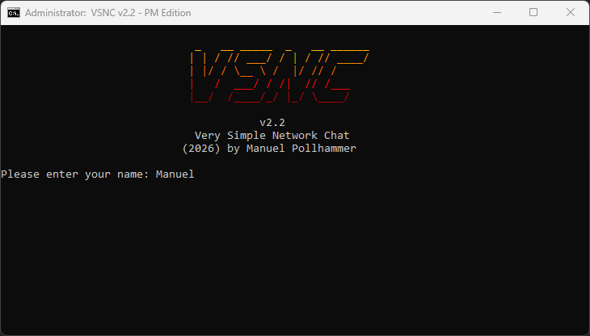
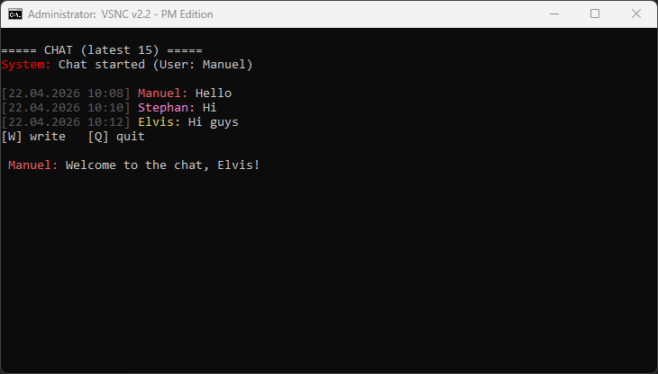
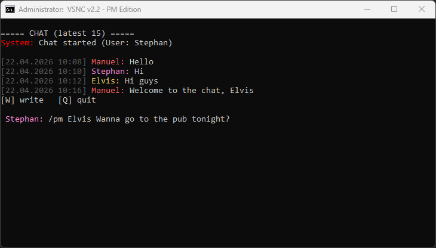
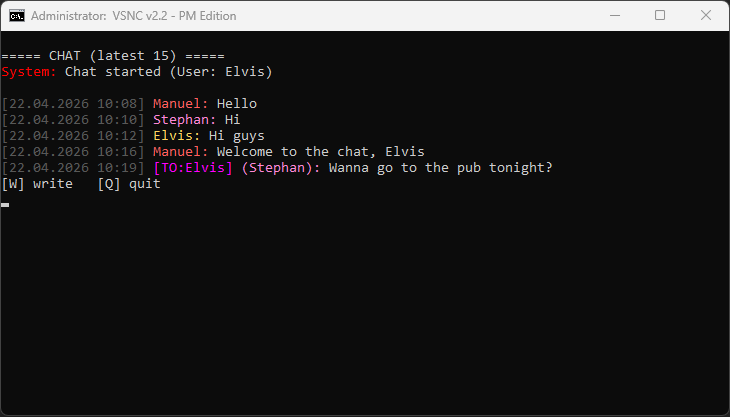
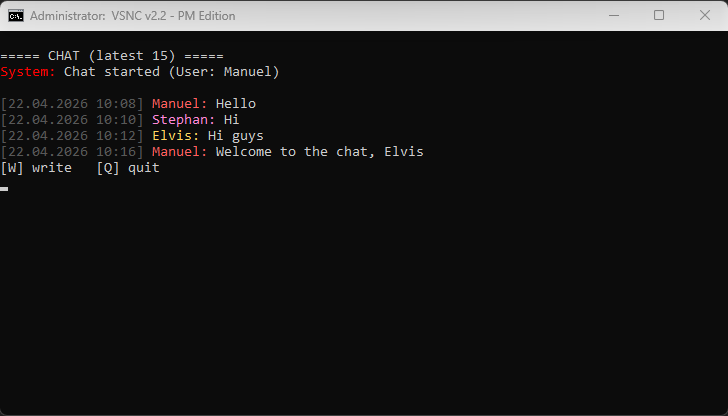
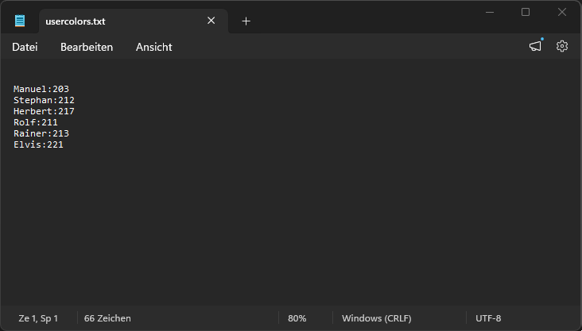

<div align="center">

 
   
# Very Simple Network Chat <br> v2.2 - PM Edition
**Minimalist CMD chat for Windows networks** <br>
by Manuel Pollhammer (2026)

</div>

---

## 🚀 What is VSNC?
**VSNC** is an ultra-lightweight, serverless chat client running entirely in a single Windows batch file. 

### 🌟 New in v2.2: Private Messaging
- **🔒 Secure PMs:** Use `/pm username message` to send encrypted-view messages.
- **👁️ Privacy Filter:** Private messages are only rendered for the sender and the recipient. Everyone else sees nothing.
- **💬 Cleaner UI:** Fixed menu flickering and optimized message spacing.

### ✨ Core Highlights
- **Plug & Play:** No installation, no dependencies.
- **Network-Ready:** Share a folder, set the path, and start chatting.
- **ANSI Styling:** Professional look with persistent user colors.
- **Encoded History:** Stores messages in **Base64** to prevent casual reading.
- **Smart Maintenance:** Auto-trims history to 15 messages for peak speed.

### ⏳ Coming Soon
*   **🔔 Audio Notifications:** System alerts (Ping) for incoming private messages.
*   **👥 User List:** Command to see all active users in the current chat directory.

---

## 🛠️ Quick Start
1. Download `vsnc.bat`.
2. Edit the storage path to a shared network folder:
   ```batch
   set "CHAT=\\YourServer\ChatShare"
   ```
3. Run the file, press **[W]** to write, and use `/pm` for private chats.

---

## 📸 Screenshots
<p align="center">
  
  <br>
  <i>Start Menu</i>
</p>

<p align="center">
  
  <br>
  <i>Public Chat Interface</i>
</p>

<p align="center">
  
  <br>
  <i>Sending a Private Message via /pm</i>
</p>

<p align="center">
  
  <br>
  <i>Recipient View (Privacy Filter active)</i>
</p>

<p align="center">
  
  <br>
  <i>Third-Party View (Private Message is hidden)</i>
</p>

<p align="center">
  
  <br>
 
 <br>
 <i>Base64 Backend Storage and User Color Configuration</i>
</p>

---
**Developed by Manuel Pollhammer | Release 2026**
